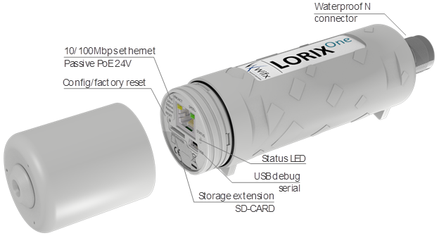

---
title: Lorix One
image: /gateways/lorix-one/image.png
section: Hardware
redirect_from:
 - /lorix-one/
 - /lorix/
----
image: /gateways/lorix-one/images/lorixone-pack.jpg
zindex: 900

# Lorix One IP43/IP65 LoRaWAN Gateway

[Lorrier LR2](https://lorrier.com/#introducing-lr2) is an improved carrier grade gateway for building professional IoT network based on LoRaWAN™ protocol. This is a fully outdoor device intended to establish a wide coverage network by telecommunications operators and local network by individuals or IoT connectivity service providers.

This guide will help you set up the gateway for The Things Network.

TBD

## Order the Lorix One
> You can place an order through bla bla 

